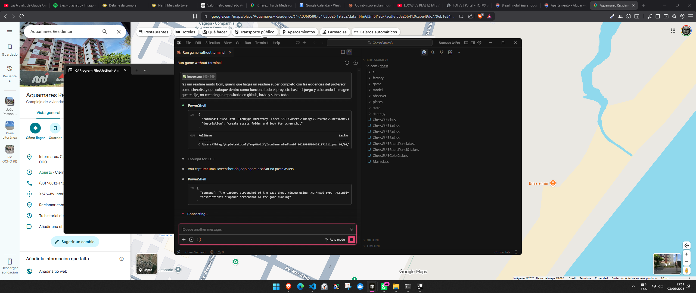

# ♟ Xadrez em Java — Padrões de Design GoF

> Jogo de xadrez completo com interface gráfica 2D, modo contra IA e contador de ELO em tempo real.
> Aplica **5 padrões de design GoF** com papel arquitetural real — o mínimo exigido era 2.

---

## 📸 Screenshot



> Interface no estilo chess.com: tabuleiro verde, painel de jogadores, ELO em tempo real e barra de status.

---

## ✅ Checklist de Requisitos do Professor

| # | Requisito | Status |
|---|-----------|--------|
| 1 | Mínimo 2 padrões de design GoF aplicados | ✅ **5 padrões** (Abstract Factory, Strategy, State, Observer, Prototype) |
| 2 | Pelo menos 1 padrão criacional | ✅ **Abstract Factory** + **Prototype** |
| 3 | Pelo menos 1 padrão comportamental | ✅ **Strategy** + **State** + **Observer** |
| 4 | Padrões com papel real na arquitetura (não "de adorno") | ✅ Cada padrão resolve um problema concreto do domínio |
| 5 | Documentação explicando onde e por que cada padrão foi usado | ✅ README + `PADROES.md` |
| 6 | Código bem organizado, com nomenclatura clara e pacotes por responsabilidade | ✅ 9 pacotes separados por camada |
| 7 | Interface com o usuário (terminal ou gráfica) | ✅ **Interface gráfica Swing** (mouse) + **terminal** (texto) |
| 8 | Funcionalidade não-trivial além dos padrões | ✅ Regras completas de xadrez, IA Minimax, ELO em tempo real |
| 9 | Testes | ✅ 15 testes funcionais + 3 testes de IA |
| 10 | Repositório Git com histórico de commits | ✅ |

---

## 📋 Visão Geral do Projeto

Este é um **jogo de xadrez 100% funcional** escrito em **Java puro**, sem nenhuma biblioteca externa.

### O que ele faz

- **Regras completas de xadrez**: roque (curto e longo), captura *en passant*, promoção de peão, xeque, xeque-mate, afogamento e empate por material insuficiente.
- **Dois modos de jogo**:
  - Humano vs. Humano (mesmo computador)
  - Humano vs. Máquina (bot **MaxBot**, 900 Elo)
- **Duas interfaces**:
  - Interface gráfica 2D com mouse (`ChessGUI.java`) — estilo chess.com
  - Terminal de texto com notação `e2 e4` (`Main.java`)
- **Contador de ELO em tempo real**: avalia a qualidade de cada jogada e ajusta seu ELO instantaneamente.

### Tecnologias

| Item | Detalhe |
|------|---------|
| Linguagem | Java (compatível com Java 21+) |
| Interface gráfica | Java Swing (incluso no JDK, sem dependências externas) |
| IA | Algoritmo Minimax com Poda Alfa-Beta, profundidade 3 |
| Testes | Scripts Java puros (sem framework) |
| Build | `javac` direto, ou IntelliJ IDEA |

---

## 🏗 Arquitetura — Como o Projeto É Organizado

O projeto foi construído **de dentro para fora** a partir dos padrões de design. Cada padrão surgiu de uma necessidade real do domínio do xadrez — nenhum foi adicionado só para "cumprir cota".

```
ChessGame/
├── src/com/chess/
│   ├── Main.java              ← Ponto de entrada: interface TERMINAL
│   ├── ChessGUI.java          ← Ponto de entrada: interface GRÁFICA (Swing + mouse)
│   │
│   ├── model/                 ← Modelo central do domínio
│   │   ├── Board.java         ← Tabuleiro 8×8 + lógica de aplicação de jogadas + PROTOTYPE (copy())
│   │   ├── Color.java         ← Enum: WHITE / BLACK
│   │   ├── Position.java      ← Coordenada imutável (linha 0-7, coluna 0-7)
│   │   └── Move.java          ← Jogada: origem, destino, tipo (normal/roque/en passant/promoção)
│   │
│   ├── pieces/                ← Peças
│   │   ├── Piece.java         ← Peça genérica — delega movimento à STRATEGY
│   │   └── PieceType.java     ← Enum: PAWN, KNIGHT, BISHOP, ROOK, QUEEN, KING
│   │
│   ├── factory/               ← Padrão ABSTRACT FACTORY
│   │   ├── AbstractPieceFactory.java   ← Interface da fábrica (cria os 6 tipos de peça)
│   │   ├── WhitePieceFactory.java      ← Fábrica para as brancas
│   │   └── BlackPieceFactory.java      ← Fábrica para as pretas
│   │
│   ├── strategy/              ← Padrão STRATEGY (movimentos)
│   │   ├── MovementStrategy.java   ← Interface: generateMoves(board, from, piece)
│   │   ├── PawnMovement.java       ← Peão: avanço simples/duplo, diagonal, en passant, promoção
│   │   ├── KnightMovement.java     ← Cavalo: 8 saltos em "L"
│   │   ├── KingMovement.java       ← Rei: 1 passo em qualquer direção + roque
│   │   ├── SlidingMovement.java    ← Lógica compartilhada para peças deslizantes
│   │   ├── RookMovement.java       ← Torre: direções retas (↑↓←→)
│   │   ├── BishopMovement.java     ← Bispo: diagonais (↗↘↙↖)
│   │   └── QueenMovement.java      ← Dama: todas as direções
│   │
│   ├── state/                 ← Padrão STATE (situação da partida)
│   │   ├── GameState.java         ← Interface: isGameOver(), sideToMove(), statusLine()
│   │   ├── OngoingState.java      ← Partida em curso, sem xeque
│   │   ├── CheckState.java        ← Em curso, com xeque
│   │   ├── CheckmateState.java    ← Fim: xeque-mate
│   │   ├── StalemateState.java    ← Fim: afogamento (empate)
│   │   └── DrawState.java         ← Fim: empate por material insuficiente
│   │
│   ├── observer/              ← Padrão OBSERVER (eventos)
│   │   ├── GameObserver.java      ← Interface: onMovePlayed(), onCheck(), onGameEnded()
│   │   └── ConsoleObserver.java   ← Observador concreto: imprime na terminal
│   │
│   ├── ai/                    ← Inteligência Artificial + ELO
│   │   ├── PlayerStrategy.java    ← Interface STRATEGY para jogadores (humano ou IA)
│   │   ├── HumanPlayer.java       ← Jogador humano (entrada do usuário)
│   │   ├── AIPlayer.java          ← MaxBot: Minimax + Poda Alfa-Beta
│   │   ├── PieceValues.java       ← Valores de material (peão=100, dama=900...)
│   │   └── EloTracker.java        ← Avaliação de qualidade de jogada + ELO em tempo real
│   │
│   └── game/
│       └── Game.java          ← Motor central: une todos os 5 padrões
│
├── test/
│   ├── TestScenarios.java     ← 15 testes: roque, en passant, promoção, afogamento...
│   └── AITest.java            ← 3 testes: IA captura, acha mate em 1...
│
├── assets/
│   └── screenshot.png         ← Screenshot da interface gráfica
│
├── PADROES.md                 ← Documentação técnica dos padrões (para o relatório)
└── README.md                  ← Este arquivo
```

### Como os componentes se comunicam

```
┌─────────────────────────────────────────────────────┐
│  ChessGUI / Main  (Interface — View)                │
│  Recebe cliques / input → chama game.commitMove()   │
└─────────────────────┬───────────────────────────────┘
                      │
┌─────────────────────▼───────────────────────────────┐
│  Game  (Motor central — Controller)                 │
│  • Pede jogadas legais via Strategy (Piece)         │
│  • Valida com Prototype (Board.copy())              │
│  • Transiciona State após cada jogada               │
│  • Notifica Observers (ConsoleObserver...)          │
└──────┬──────────────┬────────────────┬──────────────┘
       │              │                │
┌──────▼──────┐ ┌─────▼──────┐ ┌──────▼──────┐
│  Board      │ │  GameState │ │  Observers  │
│  (Prototype)│ │  (State)   │ │  (Observer) │
└──────┬──────┘ └────────────┘ └─────────────┘
       │
┌──────▼──────────────────────────────────────┐
│  Piece → MovementStrategy  (Strategy)       │
│  criada por AbstractPieceFactory (Factory)  │
└─────────────────────────────────────────────┘
```

---

## 🎯 Padrões de Design Aplicados

### 1. Abstract Factory — *Criacional*

**Problema:** o tabuleiro precisa criar 32 peças (16 brancas, 16 pretas) na posição inicial. Cada peça deve ter a cor correta e já estar conectada à estratégia de movimento correta. Acoplar o tabuleiro a cores concretas (`new Piece(Color.WHITE, ...)`) tornaria a extensão trabalhosa.

**Solução:** uma fábrica abstrata declara a família de produtos (os 6 tipos de peça) sem fixar a cor. Duas fábricas concretas produzem cada "exército" completo. O tabuleiro só conhece a interface abstrata.

```
factory/
├── AbstractPieceFactory  ← interface: createPawn(), createRook(), ..., createKing()
├── WhitePieceFactory     ← implementação para as Brancas
└── BlackPieceFactory     ← implementação para as Pretas
```

```java
// Board.java — setupInitialPosition()
AbstractPieceFactory white = new WhitePieceFactory();
AbstractPieceFactory black = new BlackPieceFactory();

grid[1][col] = white.createPawn();   // peão branco, já com PawnMovement
grid[6][col] = black.createPawn();   // peão preto, já com PawnMovement
placeBackRank(0, white);             // fileira traseira branca completa
placeBackRank(7, black);             // fileira traseira preta completa
```

A mesma fábrica é reutilizada na **promoção de peão**: `applyMove()` chama `factory.create(promotionType)` para criar a peça nova já com cor e estratégia corretas.

**Benefício:** adicionar uma variante (ex.: xadrez com peças customizadas) exige só uma nova subclasse de fábrica. O tabuleiro e o motor não mudam.

---

### 2. Strategy — *Comportamental*

**Problema:** cada tipo de peça tem uma regra de movimento completamente diferente. A abordagem ingênua seria um `switch` gigante dentro de `Piece` ou `Board` — violando o Princípio Aberto/Fechado.

**Solução:** a classe `Piece` **não sabe como se mover**. Ela delega completamente para um objeto `MovementStrategy` intercambiável. Cada tipo de peça tem sua própria estratégia.

```
strategy/
├── MovementStrategy   ← interface: generateMoves(board, from, piece)
├── PawnMovement       ← avanço, captura diagonal, en passant, promoção
├── KnightMovement     ← 8 saltos em "L"
├── KingMovement       ← 1 passo em qualquer direção + roque
├── SlidingMovement    ← lógica compartilhada para peças deslizantes
├── RookMovement       ← direções retas (usa SlidingMovement)
├── BishopMovement     ← diagonais (usa SlidingMovement)
└── QueenMovement      ← todas as direções (combina torre + bispo)
```

```java
// Piece.java — delega, sem conter lógica de movimento
public List<Move> generateMoves(Board board, Position from) {
    return movementStrategy.generateMoves(board, from, this);
}
```

O padrão Strategy é usado **duas vezes** no projeto:
1. Para o **movimento das peças** (acima)
2. Para a **tomada de decisão dos jogadores** (`ai/PlayerStrategy.java`):
   - `HumanPlayer` — a jogada vem da entrada do usuário
   - `AIPlayer` (MaxBot) — a jogada é calculada por minimax

**Benefício:** as peças deslizantes (torre, bispo, dama) compartilham o código de percorrer raios em `SlidingMovement`. Trocar a estratégia de uma peça não afeta nenhuma outra classe.

---

### 3. State — *Comportamental*

**Problema:** uma partida de xadrez passa por situações distintas — em andamento, xeque, xeque-mate, afogamento, empate — que mudam o comportamento do sistema. Gerenciar isso com variáveis booleanas espalhadas (`isCheck`, `isMate`, `isStalemate`...) torna o código frágil.

**Solução:** cada situação é um objeto que implementa a interface `GameState`. O motor mantém uma referência ao estado atual e troca de estado após cada jogada. O laço principal só pergunta `state.isGameOver()`.

```
state/
├── GameState       ← interface: isGameOver(), sideToMove(), statusLine()
├── OngoingState    ← partida em curso
├── CheckState      ← em curso, com xeque
├── CheckmateState  ← fim: xeque-mate (tem winner())
├── StalemateState  ← fim: afogamento
└── DrawState       ← fim: empate por material insuficiente
```

```java
// Game.java — transição de estado após cada jogada
private void transitionStateFor(Color next) {
    boolean inCheck  = board.isKingInCheck(next);
    boolean hasMoves = !legalMoves(next).isEmpty();

    if      (!hasMoves && inCheck)     state = new CheckmateState(next);
    else if (!hasMoves)                state = new StalemateState();
    else if (isInsufficientMaterial()) state = new DrawState("material insuficiente");
    else if (inCheck)                  state = new CheckState(next);
    else                               state = new OngoingState(next);
}

// ChessGUI.java / Main.java — o laço não conhece os estados concretos
while (!game.state().isGameOver()) { ... }
```

**Benefício:** adicionar um novo estado (ex.: empate por repetição de posição) exige só criar uma nova classe. O laço e o motor não mudam.

---

### 4. Observer — *Comportamental*

**Problema:** quando algo importante acontece na partida (peça capturada, xeque, fim de jogo), quem deve anunciar? Se o motor imprimir diretamente na tela, fica acoplado à interface — impossibilitando uma GUI sem duplicar lógica.

**Solução:** o motor (`Game`) é o *sujeito*: mantém uma lista de observadores e os notifica nos eventos. `ConsoleObserver` é o observador concreto para a terminal. A GUI redesenha o tabuleiro por conta própria ao fim de cada jogada.

```
observer/
├── GameObserver    ← interface: onMovePlayed(), onCheck(), onGameEnded()
└── ConsoleObserver ← imprime eventos na terminal
```

```java
// Main.java — registrar o observador
game.addObserver(new ConsoleObserver());

// Game.java — notificar (o motor não sabe quem está ouvindo)
private void notifyMovePlayed(Color mover, Move move, Piece captured) {
    for (GameObserver o : observers) o.onMovePlayed(mover, move, captured);
}
```

**Saída na terminal:**
```
  > Brancas: e2 e4
  > MaxBot (900 Elo) está pensando...
  > Negras: g8 f6
  ** ¡XEQUE ao Rei Branco! **
```

**Benefício:** a lógica do xadrez não sabe nada sobre "como" os eventos são exibidos. Adicionar um observador que grave o jogo em formato PGN seria zero linhas de mudança no motor.

---

### 5. Prototype — *Criacional*

**Problema:** para saber se uma jogada é **legal**, é preciso verificar que ela não deixa o próprio rei em xeque. A única forma de verificar isso com certeza é *executar* a jogada e checar — mas não podemos executar no tabuleiro real se a jogada for ilegal.

**Solução:** antes de qualquer verificação, o tabuleiro é **clonado** (cópia profunda: cada peça também é clonada). A jogada é aplicada na cópia e o xeque é verificado lá. O tabuleiro real nunca é tocado.

```java
// Board.java — o clone (Prototype)
public Board copy() {
    Board clone = new Board();
    for (int r = 0; r < 8; r++)
        for (int c = 0; c < 8; c++) {
            Piece piece = grid[r][c];
            clone.grid[r][c] = (piece == null) ? null : piece.copy();
        }
    clone.enPassantTarget = this.enPassantTarget;
    return clone;
}

// Game.java — usado na filtragem de jogadas legais
private boolean isKingSafeAfter(Move move, Color color) {
    Board simulated = board.copy();   // ← Prototype em ação
    simulated.applyMove(move);
    return !simulated.isKingInCheck(color);
}
```

O Prototype também é usado pela **IA**: para explorar variantes no minimax, cada ramo clona o tabuleiro e simula a jogada — sem interferir na partida real. E pelo **EloTracker**: para avaliar todas as jogadas possíveis comparando com a escolhida pelo jogador.

**Benefício:** a verificação de legalidade (incluindo peças "cravadas" e en passant) é 100% correta sem nenhum código de "desfazer jogada" — simplesmente descarta o clone.

---

### Como os 5 padrões colaboram (visão global)

1. **Abstract Factory** cria o exército inicial de peças, cada uma já com sua **Strategy** de movimento.
2. Cada peça usa sua **Strategy** para propor jogadas pseudo-legais.
3. O **Game** clona o tabuleiro (**Prototype**) para descartar as jogadas que deixam o rei em xeque.
4. Após a jogada válida, o **Game** transiciona de **State** (em curso → xeque → mate…).
5. Em cada passo, o **Game** avisa seus **Observers** — que exibem os eventos na tela.

---

## 🤖 A IA — MaxBot (900 Elo)

### O que é o Elo?

O **Elo** é um sistema numérico de classificação criado pelo físico Arpad Elo.

| Elo | Nível |
|-----|-------|
| < 800 | Iniciante absoluto |
| 800–1000 | Iniciante que conhece as regras |
| 1000–1400 | Jogador casual |
| 1400–1800 | Intermediário |
| 1800–2200 | Avançado / clube |
| 2500+ | Grande Mestre |

**MaxBot tem 900 Elo** — equivalente a um iniciante que não perde peças de graça e pensa 1–2 lances à frente. Comparável ao bot **"Martin"** (800) ou **"Nelson"** (1000) do chess.com.

### O algoritmo: Minimax com Poda Alfa-Beta

```
Profundidade 0 (raiz): posição atual
Profundidade 1: todas as jogadas do MaxBot        (maximiza)
Profundidade 2: todas as respostas do adversário  (minimiza)
Profundidade 3: todas as continuações do MaxBot   ← avalia aqui
```

O MaxBot olha **3 meios-lances à frente**, gerando centenas a milhares de posições por turno.

**A Poda Alfa-Beta** corta ramos da árvore que nunca poderiam ser escolhidos porque já existe uma opção melhor conhecida — reduz o número de posições avaliadas em até 90% sem mudar o resultado.

```java
// AIPlayer.java
for (Move move : moves) {
    Board next = game.board().copy();   // PROTOTYPE: clona para simular
    next.applyMove(move);
    int score = minimax(next, color.opposite(), depth - 1, alpha, beta);
    if (score > bestScore) { bestScore = score; best = move; }
    alpha = Math.max(alpha, bestScore);
}
```

### Função de avaliação

| Peça | Valor (centipeões) |
|------|-------------------|
| Peão | 100 |
| Cavalo | 300 |
| Bispo | 300 |
| Torre | 500 |
| Dama | 900 |
| Rei | 100.000 |

Pontuação = Σ(peças do MaxBot) − Σ(peças do adversário) + bônus posicional (centralidade)

### Capacidades e limitações

| | MaxBot |
|---|---|
| ✅ | Captura peças indefesas |
| ✅ | Encontra mate em 1 e alguns mates em 2 |
| ✅ | Não perde peças sem necessidade |
| ✅ | Desenvolve peças para o centro |
| ❌ | Teoria de aberturas |
| ❌ | Segurança detalhada do rei |
| ❌ | Estrutura de peões |
| ❌ | Combinações táticas com 4+ lances |

---

## 📊 Contador de ELO em Tempo Real *(feature exclusiva)*

Esta é uma feature original que **não existe em plataformas como chess.com** (que só exibe análise de qualidade após o jogo terminar). Aqui, o ELO é avaliado **a cada jogada**, em tempo real.

### Como funciona

```
Você faz uma jogada
         │
         ▼
EloTracker captura o tabuleiro ANTES da jogada (snapshot)
         │
         ▼
Minimax profundidade 3 avalia TODAS as suas jogadas legais naquela posição
         │
         ▼
Compara: score da melhor jogada possível vs. score da sua jogada
         │
         ▼
centipawnLoss = melhorScore − suaJogadaScore
         │
         ▼
Classifica e ajusta ELO (roda em thread separado — sem travar a UI)
```

### Escala de avaliação

| Perda (centipeões) | Classificação | ELO |
|---|---|---|
| ≤ 10 | Melhor jogada! ★ | **+15** |
| < 50 | Excelente ✓ | **+8** |
| < 150 | Boa jogada | **+3** |
| < 300 | Imprecisão | **-12** |
| < 600 | Erro | **-40** |
| ≥ 600 | Erro grave! | **-80** |

- ELO inicial: **1200** (padrão chess.com para iniciantes)
- ELO mínimo: **100** (não vai a zero)
- Um erro grave custa -80; são necessárias 5 melhores jogadas seguidas para recuperar

### Implementação técnica

```java
// ChessGUI.java — após a jogada do humano
final Board boardBefore = game.board().copy(); // snapshot ANTES
game.commitMove(move);

new SwingWorker<Void, Void>() {
    @Override protected Void doInBackground() {
        eloTracker.rateMove(boardBefore, committedMove, humanColor);
        return null;
    }
    @Override protected void done() { updateEloLabel(); } // atualiza UI
}.execute();
```

A avaliação roda em paralelo com o cálculo da IA, eliminando qualquer lag perceptível.

---

## ▶️ Como Executar

### Pelo IntelliJ IDEA (recomendado)

1. **File → Open…** → selecione a pasta `ChessGame`
2. Se pedir SDK: **Setup SDK** → **JDK 21** (ou "Download JDK")
3. Escolha a classe para rodar:
   - **Interface gráfica:** `src/com/chess/ChessGUI.java` → ▶
   - **Terminal:** `src/com/chess/Main.java` → ▶

### Pela linha de comando

```bash
# Compilar
cd ChessGame
javac -encoding UTF-8 -d out $(find src -name "*.java")

# Rodar (interface gráfica com mouse)
java -cp out com.chess.ChessGUI

# Rodar (terminal de texto)
java -cp out com.chess.Main
```

---

## 🎮 Como Jogar

### Interface gráfica (ChessGUI)

Ao abrir, escolha o modo:

| Opção | Descrição |
|-------|-----------|
| Dois jogadores | Dois humanos se revezam no mesmo computador |
| Contra a máquina | Você joga de Brancas, MaxBot joga de Pretas |

**Jogando:**
1. **Clique na sua peça** → os destinos legais ficam destacados em verde
2. **Clique num destino verde** → a peça se move
3. **MaxBot pensa automaticamente** → barra de status mostra "MaxBot está pensando..."
4. **Promoção de peão** → diálogo aparece para escolher a peça (Dama, Torre, Bispo ou Cavalo)
5. Botão **"Nova partida"** para reiniciar a qualquer momento
6. **ELO em tempo real** → aparece no canto superior direito, atualizado após cada jogada

### Terminal (Main)

```
Jogada:    origem destino   →   e2 e4
Roque:     mova o REI 2 casas  →   e1 g1 (curto)   e1 c1 (longo)
Comandos:  mov    → lista todas as jogadas legais
           ayuda  → exibe ajuda
           salir  → encerra a partida
```

En passant e promoção são detectados automaticamente.

---

## ✅ Testes

```bash
# Compilar testes
javac -encoding UTF-8 -cp out -d out test/TestScenarios.java test/AITest.java

# Rodar testes funcionais (15 cenários)
java -cp out TestScenarios
```

**Saída esperada:**
```
[OK] Roque curto: rei em g1
[OK] Roque curto: torre em f1
[OK] Roque longo: rei em c1
[OK] En passant: captura em d6
[OK] Promoção: dama branca aparece em a8
[OK] Xeque detectado corretamente
[OK] Afogamento: rei preto sem jogadas legais
[OK] Peça cravada não pode se mover
[OK] Mate do pastor: partida termina
... 15/15 OK
```

```bash
# Rodar testes de IA (3 cenários)
java -cp out AITest
```

**Saída esperada:**
```
[OK] IA captura dama indefesa (a1->a8)
[OK] IA encontra o mate em 1
[OK] IA não entrega a dama de graça
3/3 OK
```

---

## 🎨 Design Visual

A interface foi inspirada no **chess.com**:

| Elemento | Cor | Hex |
|----------|-----|-----|
| Casas claras | Verde claro / creme | `#EEEED2` |
| Casas escuras | Verde musgo | `#769656` |
| Casa selecionada | Amarelo | `#F6F669` |
| Destinos legais | Verde amarelado | `#BBCB6B` |
| Fundo da janela | Cinza escuro | `#2B2B2B` |
| Barra de status | Cinza médio | `#3D3D3D` |
| Botão "Nova partida" | Verde chess.com | `#769656` |
| ELO (ganho) | Verde claro | `#79D279` |
| ELO (perda) | Vermelho | `#FF6B6B` |

As **peças** são símbolos Unicode do bloco "Chess Symbols" (U+2654–U+265F) — sem arquivos de imagem externos. Peças brancas recebem um contorno escuro (deslocamento de 1 pixel) para se destacar nas casas claras.

---

## 📁 Arquivos de Documentação

| Arquivo | Conteúdo |
|---------|----------|
| `README.md` | Visão geral, arquitetura, padrões, como executar e jogar |
| `PADROES.md` | Documentação técnica aprofundada dos 5 padrões (para o relatório) |

---

*Projeto desenvolvido para a disciplina de Padrões de Design de Software.*
